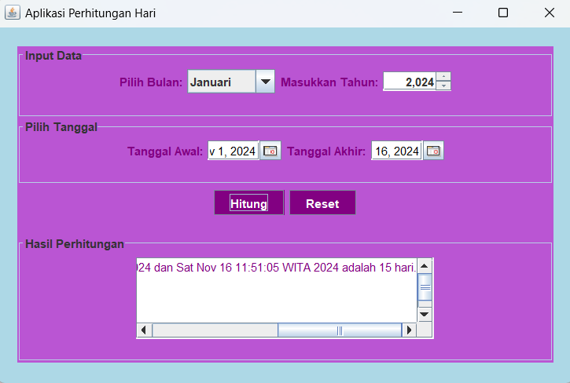

# AplikasiPerhitunganHari
 Tugas4_NovitaFitriaRatnawati_2210010228
 
# Aplikasi Perhitungan Hari
Aplikasi Perhitungan Hari adalah aplikasi untuk menghitung selisih tanggal Hari

# Keunggulan Aplikasi
- Perhitungan Hari: Aplikasi ini terdapat Jdatechooser untuk mempermudah memilih tanggal 

# Pembuat Aplikasi
 Novita Fitria Ratnawati - 2210010228 - Tugas 4

# Fitur
Aplikasi ini menawarkan fitur:

Perhitungan Hari

## Cara Menjalankan

1. Run File
2. Pilih Tanggal Awal yang mau kita input menggunakan Jdatechooser
3. Pilih Tanggal Akhir yang mau kita input menggunakan Jdatechooser
4. Tekan Button Hitung, Maka akan keluar hasil
5. Tekan Button Reset, jika ingin mengulang

# Demo
